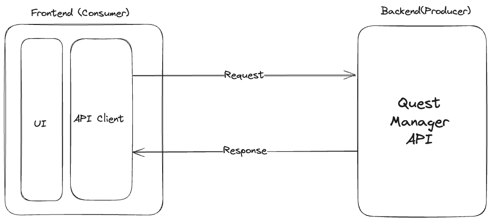

# Crafting API Contracts with Pact 
A Link to Reliable Microservices

## The Master Sword of Microservices Reliability

In the legendary *The Legend of Zelda* video game series, the Master Sword is celebrated as the most powerful weapon a hero can wield. Known as the “Sword that Seals the Darkness,” it is a mythical blade imbued with the ability to banish chaos and restore balance. More than just a tool for battle, it is a symbol of strength, reliability, and the power to overcome overwhelming challenges. Without it, the hero, Link, would struggle to achieve victory against the forces of evil.

In the world of microservices, developers face a different kind of battle—not against monsters or sorcerers, but against mismatched APIs, brittle integrations, and the chaos of broken systems. Much like Link without his legendary weapon, teams without the right tools are left vulnerable to these challenges, fighting an uphill battle to maintain consistent communication between services.

But what if you had your own Master Sword to cut through the chaos? A tool that could seal the darkness of unreliable integrations and bring clarity and harmony to your APIs? Enter API contracts. Like the legendary sword, API contracts are the ultimate source of reliability, creating a single source of truth for how services interact.

This article will guide you in wielding this powerful weapon with Pact. Whether you’re at the start of your microservices journey or deep into a complex architecture, you’ll learn how to:

- **Design** API contracts that eliminate integration headaches and prevent communication failures.
- **Leverage** Pact to automate tests and enforce consistent service interactions.
- **Foster** seamless collaboration between services, creating a well-oiled microservices ecosystem.

With API contracts in your arsenal, you’ll have the power to conquer the chaos of microservices and craft a system as legendary as the Master Sword itself.

---

## Understanding API Contracts: The Sheikah Slate for Your Microservices Journey


In any grand adventure, a hero needs more than just a powerful weapon—they need guidance and tools to navigate complex challenges. In *The Legend of Zelda: Breath of the Wild*, Link relies on the Sheikah Slate, a mystical device that grants him access to maps, abilities, and crucial information about his environment. With it, he can traverse vast landscapes, solve intricate puzzles, and unlock secrets that would otherwise remain hidden.

In the realm of microservices, API contracts serve a similar purpose. They act as a guiding tool, mapping out how services should interact and helping development teams navigate the complexities of distributed systems. Without a clear API contract—much like Link without his Sheikah Slate—teams can easily get lost in a maze of miscommunication and integration issues.

An API contract is essentially a blueprint that defines the interaction between a service provider and a service consumer. It specifies inputs, outputs, and expected behaviors, creating a shared understanding among all parties involved. Without this shared understanding, you might encounter:

- **Broken integrations:** Services fail to communicate effectively due to mismatched expectations.
- **Brittle systems:** Changes in one service inadvertently break others, leading to unstable environments.
- **Slower development cycles:** Teams waste valuable time troubleshooting integration issues instead of building new features.

By providing a single source of truth, API contracts illuminate the path forward, ensuring that all services are aligned and communication is seamless.

---

## Designing an API Contract: Building the Map Before the Journey

Before we dive into the tools for implementing contract testing, let’s clarify the roles of microservices in a distributed system. Think of them as characters in a quest: the **consumer** is the eager adventurer, initiating requests to complete their mission, while the **provider** is the wise oracle, offering guidance and fulfilling those requests to enable success.

Now, let’s bring these roles to life with a practical example:

### The Quest Tracker Application

We’re building a Quest Tracker Application, a system designed to help adventurers manage their quests effectively. The application will interact with a Quest Manager API, which serves as the backend service providing quest-related data and operations.

In this demo:

- The **consumer** is the Quest Tracker Application, which initiates requests to fetch and update quest data.
- The **provider** is the Quest Manager API, responsible for processing these requests and delivering the required responses.
  
**Requirements:**

1. **Fetching a list of quests:** The application will display all available quests, along with their details (e.g., name, status, and reward).
2. **Updating the current status of a quest:** The application will allow users to update the status of a specific quest (e.g., marking it as completed or in-progress).

---

### **Architecture Overview:**

- **Frontend Layer:** The UI components of the application will use an API Client Implementation which lives in the frontend code and manages all backend communication.
- **Backend Layer:** The Quest Manager API processes requests and provides responses to fulfill the expectations set by the consumer. It acts as the backbone of the system, ensuring that all data-related operations are executed efficiently and accurately. This layer is where business logic resides, handling tasks like validating inputs, managing database interactions, and formatting output responses for the frontend consumer.



Setting up an API contract begins with defining the interactions between services. These interactions should clearly establish what the consumer needs and what the provider guarantees to deliver. Think of it as drafting a treaty where both sides agree on the exact terms to avoid misunderstandings later. This involves detailing key elements such as endpoints, request formats, response payloads, and expected status codes. Let’s frame this with our demo example:

### Key Elements of the Contract:

1. **Specify HTTP Methods and Endpoints**

    - Endpoint: `/quest`
        - **Method:** GET
        - **Purpose:** Retrieve a list of all available quests.
   
    - Endpoint: `/quest/{id}`
        - **Method:** PUT
        - **Purpose:** Update the status of a specific quest.

2. **Define the Inputs and Outputs**

    - **Fetching the quests via `GET /quest`:**

        - **Input:** No request body required for fetching quests.
        - **Output:** JSON array containing quest details such as quest name, status, and reward.
          ```json
          [
            {
              "id": 1,
              "name": "Locate the Ancient Sword",
              "status": "in-progress",
              "reward": "100 gold"
            },
            {
              "id": 2,
              "name": "Rescue the Royal Heir",
              "status": "not-started",
              "reward": "Title of Champion"
            }
          ]
          ```

    - **Updating a quest via `PUT /quest/{id}`:**
        - **Input:** JSON body with a new quest status.
          ```json
          {
            "status": "COMPLETED"
          }
          ```
        - **Output:** JSON object showing the updated quest details.
          ```json
          {
            "id": 1,
            "name": "Locate the Ancient Sword",
            "status": "COMPLETED",
            "reward": "100 gold"
          }
          ```

3. **Define Status Codes**

    - `200 OK:` The request was successful.
    - `404 Not Found:` The quest ID does not exist.
      ```json
      { "error": "Quest not found." }
      ```
    - `400 Bad Request:` Invalid input, such as an unsupported status value.
      ```json
      { "error": "Invalid quest status." }
      ```

4. **Document Edge Cases**

    - What happens if a client sends an invalid status, like `paused`, to the `PUT /quest/{id}` endpoint?
    - What happens if the requested quest ID doesn’t exist?
    - What happens if an invalid status transition is requested? E.g., Changing a quest from “completed” to “not started.”

---

### Enforcing API Contracts with Pact

With our API contract designed, it’s time to ensure that both the consumer (Quest Tracker application) and the provider (Quest Manager API) adhere to it. This is where Pact steps in. Pact facilitates consumer-driven contract testing, ensuring that the provider always meets the consumer’s expectations. By catching integration issues early, Pact significantly improves development efficiency and reduces runtime errors.

For this example, we’ll use Java and Spring to implement both the consumer and the provider. Pact serves as the enforcer, ensuring the two services remain in sync as they evolve.

#### Consumer Code Implementation:

```java
public class QuestManagerClient extends ApiClient {

    public QuestManagerClient(String baseUrl) {
        super(baseUrl);
    }

    public ApiResponse<QuestResponse[]> getQuests() {
        return get("/quest", QuestResponse[].class);
    }

    public ApiResponse<QuestResponse> updateQuestStatus(String questId, String status) {
        return put("/quest/" + questId, new QuestUpdateRequest(status), QuestResponse.class);
    }

    public record QuestResponse(int id, String name, String reward, String status) {
    }

    public record QuestUpdateRequest(String status) {
    }
```

### Writing a Consumer Test with Pact:

To set up a consumer test for our API contract, we need to follow these key steps:

### 1. Define the Scope of the Test

- Identify the interaction you want to test. In this case, we will use \`GET /quest\` endpoint for fetching a list of quests.

### 2. Prepare the Pact Annotations

-  In java, we need to use the \`@Pact\` annotation to specify the provider (QuestManagerApi) and the consumer (QuestManagerApiClient). This connects the test to the relevant services and will be used as identifiers in the pact document

### 3. Build the Pact Interaction

&#x20;  Defining a test involves focusing on three key parts:

- **State Definition**: Establish the initial conditions or assumptions for the test (e.g., "at least one quesDefine what the provider should return, including the HTTP status code, response body, and headers. This helps validate that the provider can deliver the agreed-upon output for the consumer's request. Similary to the request, we here have willRespondWith() which will signalize pact about the begining of the response.e.
- **Request Details**: Clearly specify the request that the consumer will send, including the HTTP method, endpoint, headers, and query parameters. This ensures the consumer's request aligns with the provider's expectations. In our code, this block starts with the uponReceiving() method.
- **Response Expectations**: Define what the provider should return, including the HTTP status code, response body, and headers. This helps validate that the provider can deliver the agreed-upon output for the consumer's request. Similarly, for the response, we use willRespondWith(), which signals to Pact that the response block begins.


```java

@Pact(provider = "QuestManagerApi", consumer = "QuestManagerApiClient")
public V4Pact createPactForGetQuests(PactDslWithProvider builder) {
    return builder.given("at least one quest exists in the database")
            .uponReceiving("A GET request to /quest endpoint")
            .path("/quest")
            .method("GET")
            .willRespondWith()
            .status(200)
            .body(newJsonArray((q) -> q.object((quest) -> {
                quest.numberType("id", 1);
                quest.stringType("name");
                quest.stringType("reward");
                quest.stringMatcher("status", "NOT_STARTED|IN_PROGRESS|COMPLETED");
            })).build())
            .toPact(V4Pact.class);
}
```

#### Running and Verifying the Test:

To actually test the Pact contract from the consumer side, we simply create a unit test that triggers the mock server. Pact handles the setup of the mock server, manages responses, and ensures they match the defined contract.

```java
@Test
@PactTestFor(providerName = "QuestManagerApi", pactMethod = "createPactForGetQuests")
void should_respond_with_quests(MockServer mockServer) {
    var questManagerClient = new QuestManagerClient(mockServer.getUrl());
    var quests = questManagerClient.getQuests();
    assertThat(quests.success()).isTrue();
    assertThat(quests.data()).hasSizeGreaterThan(0);
    assertThat(quests.data()).allMatch(quest ->
            List.of("NOT_STARTED", "IN_PROGRESS", "COMPLETED").contains(quest.status())
    );
}
```

In this test, Pact works under the hood to create a mock server that simulates the provider's behavior. The mock server handles the responses and ensures they match the expectations defined in the contract. This allows the consumer’s requests to be validated against the contract without needing the actual provider implementation.

By following these steps, you create a reliable test that ensures your consumer and provider remain aligned, preventing integration issues as both evolve.

For more examples related to consumer-side contract testing[, yo](https://github.com/g-terra/pact-quest-demo/tree/main/src/test/java/dev/terralab/blog/examples/pactquestdemo/contract/consumer)[u can explore this demo's repository at ](https://github.com/g-terra/pact-quest-demo/tree/main/src/test/java/dev/terralab/blog/examples/pactquestdemo/contract/consumer)[https://github.com/g-terra/pact-quest-demo/tree/main/src/test/java/dev/terralab/blog/examples/pactquestdemo/contract/consumer](https://github.com/g-terra/pact-quest-demo/tree/main/src/test/java/dev/terralab/blog/examples/pactquestdemo/contract/consumer).

