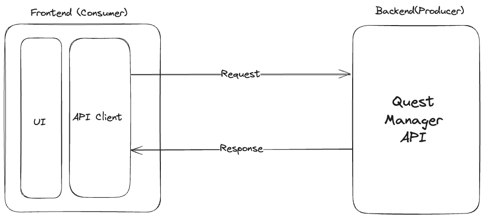
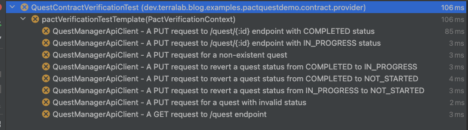

 
Photo by <a href="https://unsplash.com/@fvgromanelli?utm_content=creditCopyText&utm_medium=referral&utm_source=unsplash">Francisco Gonzalez Romanelli</a> on <a href="https://unsplash.com/photos/a-nintendo-game-console-sitting-on-top-of-a-stack-of-books-H3mUR3_eeEo?utm_content=creditCopyText&utm_medium=referral&utm_source=unsplash">Unsplash</a>

# Crafting API Contracts with Pact

A Link to Reliable Microservices

# Table of Contents

1. [The Master Sword of Microservices Reliability](#the-master-sword-of-microservices-reliability)
2. [Understanding API Contracts: The Sheikah Slate for Your Microservices Journey](#understanding-api-contracts-the-sheikah-slate-for-your-microservices-journey)
3. [Designing an API Contract: Mapping the Castle’s Grounds for the Journey](#designing-an-api-contract-mapping-the-castle’s-grounds-for-the-journey)
    - [The Quest Tracker Application](#the-quest-tracker-application)
    - [Requirements](#requirements)
    - [Architecture Overview](#architecture-overview)
    - [Key Elements of the Contract](#key-elements-of-the-contract)
4. [Enforcing API Contracts with Pact](#enforcing-api-contracts-with-pact)
    - [Writing a Consumer Test with Pact](#writing-a-consumer-test-with-pact)
    - [Setting the consumer side](#setting-the-consumer-side)
    - [Interactions with Provider](#interactions-with-provider)
    - [Define the Scope of the Consumer Test](#define-the-scope-of-the-consumer-test)
    - [Prepare the Pact Annotations](#prepare-the-pact-annotations)
    - [Build the Pact Interaction](#build-the-pact-interaction)
    - [Verifying the Pact Contract](#verifying-the-pact-contract)
5. [Exploring the Castle: The Provider's Perspective](#exploring-the-castle-the-providers-perspective)
    - [Setting Up the Provider Dependency](#setting-up-the-provider-dependency)
    - [Managing the Pact File](#managing-the-pact-file)
    - [Verifying Interactions with Pact](#verifying-interactions-with-pact)
    - [Managing Provider States](#managing-provider-states)
    - [Mocked Repository vs. Real Storage](#mocked-repository-vs-real-storage)
6. [Triumph in the Castle: A Harmonious Microservices Ecosystem](#triumph-in-the-castle-a-harmonious-microservices-ecosystem)

---
## The Master Sword of Microservices Reliability

In the legendary *The Legend of Zelda* video game series, the Master Sword is celebrated as the most powerful weapon a hero can wield. Known as the “Sword that Seals the Darkness,” it is a mythical blade imbued with the ability to banish chaos and restore balance. More than just a tool for battle, it is a symbol of strength, reliability, and the power to overcome overwhelming challenges. Without it, the hero, Link, would struggle to achieve victory against the forces of evil.

In the world of microservices, developers face a different kind of battle—not against monsters or sorcerers, but against mismatched APIs, brittle integrations, and the chaos of broken systems. Much like Link without his legendary weapon, teams without the right tools are left vulnerable to these challenges, fighting an uphill battle to maintain consistent communication between services.

But what if you had your own Master Sword to cut through the chaos? A tool that could seal the darkness of unreliable integrations and bring clarity and harmony to your APIs? Enter API contracts. Like the legendary sword, API contracts are the ultimate source of reliability, creating a single source of truth for how services interact.

This article will guide you in wielding this powerful weapon with Pact. Whether you’re at the start of your microservices journey or deep into a complex architecture, you’ll learn how to:

- **Design** API contracts that eliminate integration headaches and prevent communication failures.
- **Leverage** Pact to automate tests and enforce consistent service interactions.
- **Foster** seamless collaboration between services, creating a well-oiled microservices ecosystem.

With API contracts in your arsenal, you’ll have the power to conquer the chaos of microservices and craft a system as legendary as the Master Sword itself.

---
## Understanding API Contracts: The Sheikah Slate for Your Microservices Journey

In any grand adventure, a hero needs more than just a powerful weapon—they need guidance and tools to navigate complex challenges. In *The Legend of Zelda: Breath of the Wild*, Link relies on the Sheikah Slate, a mystical device that grants him access to maps, abilities, and crucial information about his environment. With it, he can traverse vast landscapes, solve intricate puzzles, and unlock secrets that would otherwise remain hidden.

In the realm of microservices, API contracts serve a similar purpose. They act as a guiding tool, mapping out how services should interact and helping development teams navigate the complexities of distributed systems. Without a clear API contract—much like Link without his Sheikah Slate—teams can easily get lost in a maze of miscommunication and integration issues.

An API contract is essentially a blueprint that defines the interaction between a service provider and a service consumer. It specifies inputs, outputs, and expected behaviors, creating a shared understanding among all parties involved. Without this shared understanding, you might encounter:

- **Broken integrations:** Services fail to communicate effectively due to mismatched expectations.
- **Brittle systems:** Changes in one service inadvertently break others, leading to unstable environments.
- **Slower development cycles:** Teams waste valuable time troubleshooting integration issues instead of building new features.

By providing a single source of truth, API contracts illuminate the path forward, ensuring that all services are aligned and communication is seamless.

---
## Designing an API Contract: Mapping the Castle’s Grounds for the Journey

Before diving into the tools for implementing contract testing, let’s set the stage for this grand adventure. In the world of microservices, think of the **consumer** as the adventurer, embarking on quests to achieve their mission, while the **provider** is the trusty castle, offering resources, treasures, and the occasional hidden trap (or error response) to make the journey memorable.

Now, let’s bring these roles to life with a practical example. This will involve outlining key elements such as endpoints, request formats, response payloads, and expected status codes. Let’s frame this using our demo example:

### The Quest Tracker Application

Imagine we’re creating a Quest Tracker Application—a magical tool that helps adventurers (our consumers) manage their epic quests with ease. This application will interact with the Quest Manager API, a grand castle brimming with treasures (quest data) and challenges to overcome.

In this enchanting demo:

- **The consumer:** The Quest Tracker Application, the brave adventurer venturing forth to request and update quest data.
- **The provider:** The Quest Manager API, the castle gatekeeper processing these requests and delivering treasures (or responses).

### Requirements

1. **Fetching a list of quests:** The application will display all available quests, complete with names, statuses, and rewards—because every adventurer loves loot.
2. **Updating the status of a quest:** The application will allow users to update a quest’s status, marking it as completed or in progress.

### Architecture Overview

- **Frontend Layer:** Like a detailed adventurer’s map, the UI components guide the interaction with the castle. These components rely on an API Client Implementation to navigate and communicate effectively.
- **Backend Layer:** The Quest Manager API is the castle’s control room, managing data-related operations like validating inputs, interacting with databases, and formatting responses. This ensures that every adventurer’s request is processed efficiently and reliably, providing a seamless experience in the castle halls.



### Key Elements of the Contract:

1. **Specify HTTP Methods and Endpoints**

   - Endpoint: `/quest`
      - **Method:** GET
      - **Purpose:** Retrieve a list of all available quests.
   - Endpoint: `/quest/{id}`
      - **Method:** PUT
      - **Purpose:** Update the status of a specific quest.

2. **Define the Inputs and Outputs**

   - **Fetching the quests via **`GET /quest`**:**

      - **Input:** No request body required for fetching quests.
      - **Output:** JSON array containing quest details such as quest name, status, and reward.
        ```json
        [
          {
            "id": 1,
            "name": "Locate the Ancient Sword",
            "status": "in-progress",
            "reward": "100 gold"
          },
          {
            "id": 2,
            "name": "Rescue the Royal Heir",
            "status": "not-started",
            "reward": "Title of Champion"
          }
        ]
        ```

   - **Updating a quest via **``**:**

      - **Input:** JSON body with a new quest status.
        ```json
        {
          "status": "COMPLETED"
        }
        ```
      - **Output:** JSON object showing the updated quest details.
        ```json
        {
          "id": 1,
          "name": "Locate the Ancient Sword",
          "status": "COMPLETED",
          "reward": "100 gold"
        }
        ```

3. **Define Status Codes**

   - `200 OK:` The request was successful.
   - `404 Not Found:` The quest ID does not exist.
     ```json
     { "error": "Quest not found." }
     ```
   - `400 Bad Request:` Invalid input, such as an unsupported status value.
     ```json
     { "error": "Invalid quest status." }
     ```

4. **Document Edge Cases**

   - What happens if a client sends an invalid status, like `paused`, to the `PUT /quest/{id}` endpoint?
   - What happens if the requested quest ID doesn’t exist?
   - What happens if an invalid status transition is requested? E.g., Changing a quest from “completed” to “not started.”

---
## Enforcing API Contracts with Pact

Pact is a contract testing tool that ensures seamless integration between APIs by validating the agreements (or contracts) established between consumers and producers. It works by enabling consumers to define their expectations for API behavior, which producers then use to validate their implementation. This ensures that changes in the API do not break existing integrations and helps catch mismatches early. For more details, refer to the [Pact documentation](https://docs.pact.io).

### Writing a Consumer Test with Pact:

To set up a consumer test for our API contract, let’s break it down into digestible steps that ensure clarity and precision. While this demo focuses on Java, the core principles and steps are highly replicable across all languages supported by Pact, making it a versatile tool for any development environment. Whether you’re slaying your first API dragon or are a seasoned knight in the realm of microservices, this guide will arm you with everything you need.

### Setting the consumer side

Our demo project is a Java 21 application built with Spring Boot and leverages Spring 6. These technologies were chosen for their modern capabilities, such as Java 21's enhanced performance features and Spring 6's advanced features like built-in dependency injection and enhanced testing tools, enabling us to demonstrate Pact in a simple and effective way. While Java was selected for this demo, Pact supports a wide range of languages such as Python, JavaScript, and Ruby, and the usage structure remains consistent across these ecosystems. To manage dependencies, we are using Maven. For simplicity, both the consumer and provider code will be housed in the same repository. As we are focusing on the consumer side, we will need to add the consumer-specific dependency to enable Pact contract testing in our project. Here’s how you can set it up in your pom.xml file:

```xml
<dependency>
    <groupId>au.com.dius.pact.consumer</groupId>
    <artifactId>junit5</artifactId>
    <version>4.6.16</version>
    <scope>test</scope>
</dependency>
```

### Interactions with provider

Before diving into the tests, let’s look at the code used to interact with our backend. This example demonstrates a simple client for managing quests:

```java
public class QuestManagerClient extends ApiClient {

    public QuestManagerClient(String baseUrl) {
        super(baseUrl);
    }

    public ApiResponse<QuestResponse[]> getQuests() {
        return get("/quest", QuestResponse[].class);
    }

    public ApiResponse<QuestResponse> updateQuestStatus(String questId, String status) {
        return put("/quest/" + questId, new QuestUpdateRequest(status), QuestResponse.class);
    }

    public record QuestResponse(int id, String name, String reward, String status) {
    }

    public record QuestUpdateRequest(String status) {
    }
}
```

This class abstracts API calls to the backend and serves as the adventurer’s essential toolkit on their journey through the backend world. Much like a detailed quest map, the `QuestManagerClient` provides clear and simple methods to fetch available quests (`getQuests`) and update their statuses (`updateQuestStatus`). It acts as the adventurer’s reliable guide, ensuring the path to treasures—or functional APIs—is smooth and well-marked. Its flexibility makes it easy to test and integrate into your development workflow, enabling you to focus on overcoming challenges with clarity and efficiency.

### Define the Scope of the Consumer test

Think of this step as preparing your adventurer (consumer) to embark on a quest to the backend castle (provider). For this example, our brave adventurer is heading to the `GET /quest` endpoint to fetch a list of available quests. Each quest represents a task or challenge, and the endpoint is the map guiding our adventurer to these tasks.

### Prepare the Pact Annotations

Every adventurer needs to register at the guild before starting a quest, and Pact annotations serve this purpose. Use the `@Pact` annotation to register your adventurer (consumer) and the castle (provider) they will interact with. For example, `QuestManagerApi` acts as the castle while `QuestManagerApiClient` is our adventurer. These annotations ensure the quests are tracked and identified correctly in the Pact document.

### Build the Pact Interaction

Now that the adventurer is ready, it’s time to describe the journey. Setting up the interaction in Pact is like documenting the adventurer’s planned actions and the castle’s expected responses. Focus on three key parts:

- **State Definition**: This is the adventurer’s starting point, such as "at least one quest exists in the database." Use the `given()` method to define this state, ensuring the castle is prepared for the adventurer’s arrival.
- **Request Details**: Here, the adventurer submits their request to the castle—like asking the guildmaster for a quest. Specify the HTTP method, endpoint, headers, and any query parameters using the `uponReceiving()` method.
- **Response Expectations**: Once the adventurer makes their request, the castle provides a response—perhaps a quest with a detailed description. Define this response with the expected HTTP status, headers, and body using the `willRespondWith()` method.

Below is an example Pact interaction for the `GET /quest` endpoint:

```java
@Pact(provider = "QuestManagerApi", consumer = "QuestManagerApiClient")
public V4Pact createPactForGetQuests(PactDslWithProvider builder) {
    return builder.given("at least one quest exists in the database")
            .uponReceiving("A GET request to /quest endpoint")
            .path("/quest")
            .method("GET")
            .willRespondWith()
            .status(200)
            .body(newJsonArray((q) -> q.object((quest) -> {
                quest.numberType("id", 1);
                quest.stringType("name");
                quest.stringType("reward");
                quest.stringMatcher("status", "NOT_STARTED|IN_PROGRESS|COMPLETED");
            })).build())
            .toPact(V4Pact.class);
}
```

### Verifying the Pact Contract

Verifying the Pact contract is like an adventurer huddling with their team to review the attack strategy before charging into the castle. Skipping this step and screaming ["Leroy Jenkins!"](https://www.youtube.com/watch?v=Zll_jAKvarw) is the equivalent of deploying to production without tests—a surefire way to face utter chaos. This critical step ensures that every move, defense mechanism, and every strategy detail matches the plan crafted to overcome the castle’s defenses. To achieve this, we set up a unit test that triggers a mock server simulating the castle’s responses. Here, Pact steps in as the tactical advisor, meticulously analyzing every detail to confirm that the mock server’s responses align with the established contract, ensuring the adventurer is fully prepared for the challenges ahead.

```java
@Test
@PactTestFor(providerName = "QuestManagerApi", pactMethod = "createPactForGetQuests")
void should_respond_with_quests(MockServer mockServer) {
   var questManagerClient = new QuestManagerClient(mockServer.getUrl());
   var quests = questManagerClient.getQuests();
   assertThat(quests.success()).isTrue();
   assertThat(quests.data()).hasSizeGreaterThan(0);
   assertThat(quests.data()).allMatch(quest ->
           List.of("NOT_STARTED", "IN_PROGRESS", "COMPLETED").contains(quest.status())
   );
}
```

In conclusion, this approach equips our adventurer with a reliable and efficient battle plan to tackle integration challenges. By meticulously crafting and verifying the Pact contract, the consumer is armed with a shield against unexpected API behavior, ensuring a seamless and predictable journey through the backend realm.

For additional "adventures" of consumer-side contract testing, check out the [Pact Quest Demo repository](https://github.com/g-terra/pact-quest-demo/tree/main/src/test/java/dev/terralab/blog/examples/pactquestdemo/contract/consumer).

---
## Exploring the Castle: The Provider's Perspective

Once inside the castle (the provider’s domain), we need to ensure that every path, corridor, and hidden passage is meticulously prepared to meet the adventurer’s (consumer’s) expectations. Each route through the castle must lead to exactly what the adventurer seeks, ensuring smooth and reliable interactions at every turn. The provider’s role is critical: it’s not just about responding to requests but doing so consistently, reliably, and within the agreed-upon boundaries set by the API contract.

### Setting Up the Provider Dependency

To get started, include the necessary dependency for Spring-based provider-side testing:

```xml
<dependency>
    <groupId>au.com.dius.pact.provider</groupId>
    <artifactId>spring6</artifactId>
    <version>4.6.16</version>
    <scope>test</scope>
</dependency>
```

### Managing the Pact File

The Pact file is a vital artifact in contract testing. It encapsulates the agreed-upon expectations between the consumer and provider. When you run your consumer tests, the Pact file is automatically generated and stored inside the `target` folder. For our demo, we’ve created a `make` command to automate the process of generating the file and moving it to a designated folder accessible to the provider. This ensures seamless integration. To integrate it effectively, you also need to set up your provider test class appropriately. For example:

```java
@SpringBootTest(webEnvironment = SpringBootTest.WebEnvironment.DEFINED_PORT)
@Provider("QuestManagerApi")
@PactFolder("pacts")
public class QuestContractVerificationTest {
    // tests
}
```

This setup ensures that the provider uses the correct Pact file stored locally in the `pacts` folder, enabling the tests to validate interactions against the defined contract. While teams working in distributed environments might consider using a [Pact Broker](https://docs.pact.io/getting_started/sharing_pacts) for managing and sharing these files, for the purpose of this demo, we will keep things simple and store the Pact file locally in the repository.

### Verifying Interactions with Pact

Spring takes care of dynamically generating the provider tests based on the Pact files. The following snippet shows how to verify interactions:

```java
@TestTemplate
@ExtendWith(PactVerificationSpring6Provider.class)
void pactVerificationTestTemplate(PactVerificationContext context) {
    context.verifyInteraction();
}
```

When you run the test, Spring orchestrates the verification process by comparing the provider’s responses to the expectations outlined in the Pact file. This ensures alignment between the consumer and provider. Running the tests will generate results, and here we can visualize test failures:



### Managing Provider States

Provider-side contract tests rely heavily on states to simulate different scenarios. States allow the provider to prepare its responses based on specific conditions, much like a castle readying its rooms to accommodate adventurers. Each state is like preparing treasures or setting traps within a tower (API endpoint) to challenge or reward the adventurer. For instance, you might ready a treasure chest in the form of a valid response or an enemy such as an error state to test the adventurer's resilience. For example:

```java
@State("Quest with ID 1 exists in the database")
public Map<String, Object> questWithId1Exists() {
    var id = 1L;
    Mockito.when(questRepository.findById(id)).thenReturn(Optional.of(new Quest(id, "Quest 1", Status.NOT_STARTED, "100 XP")));
    return Map.of("id", id);
}
```

With this setup, we align with the principles of Test-Driven Development (TDD), ensuring that our provider implementation adheres to predefined consumer expectations.

### Managing Provider States

Provider-side contract tests rely heavily on states to simulate different scenarios. States allow the provider to prepare its responses based on specific conditions, much like a castle readying its rooms to accommodate adventurers. Each state is like preparing treasures or setting traps within a tower (API endpoint) to challenge or reward the adventurer. For instance, you might ready a treasure chest in the form of a valid response or an enemy such as an error state to test the adventurer's resilience. For example:

```java
@State("Quest with ID 1 exists in the database")
public Map<String, Object> questWithId1Exists() {
    var id = 1L;
    Mockito.when(questRepository.findById(id)).thenReturn(Optional.of(new Quest(id, "Quest 1", Status.NOT_STARTED, "100 XP")));
    return Map.of("id", id);
}
```

In this snippet, we simulate the existence of a quest with ID 1 in the database, ensuring the provider meets the consumer's expectations for this state.

### Mocked Repository vs. Real Storage

For demonstration purposes, the repository interactions are mocked using tools like Mockito. However, in real-world scenarios, it’s advisable to use [test containers]\(**[https://testcontainers.com/](https://testcontainers.com/)** )or similar tools to spin up actual databases in a controlled test environment. This approach allows tests to better mimic real-world conditions without requiring a full integration environment.

--- 
## Triumph in the Castle: A Harmonious Microservices Ecosystem

With Pact and other tools, we’re not just setting up some tests; we’re building a castle where every tower (API endpoint) shines like a reliable beacon. These towers don’t just look good—they deliver treasures (data) when our adventurers (consumers) need them and tame any lurking adversaries (errors).

This harmonious system lets consumers and providers waltz together beautifully, all thanks to those trusty contracts. It’s like signing a magical treaty that says, "We’ll always understand each other." Using Pact, Spring, and advanced helpers like TestContainers, we can turn the chaos of distributed systems into a well-orchestrated symphony.

In the end, we’re crafting more than code—we’re building a system that’s legendary, enduring, and as reliable as the Master Sword itself.


